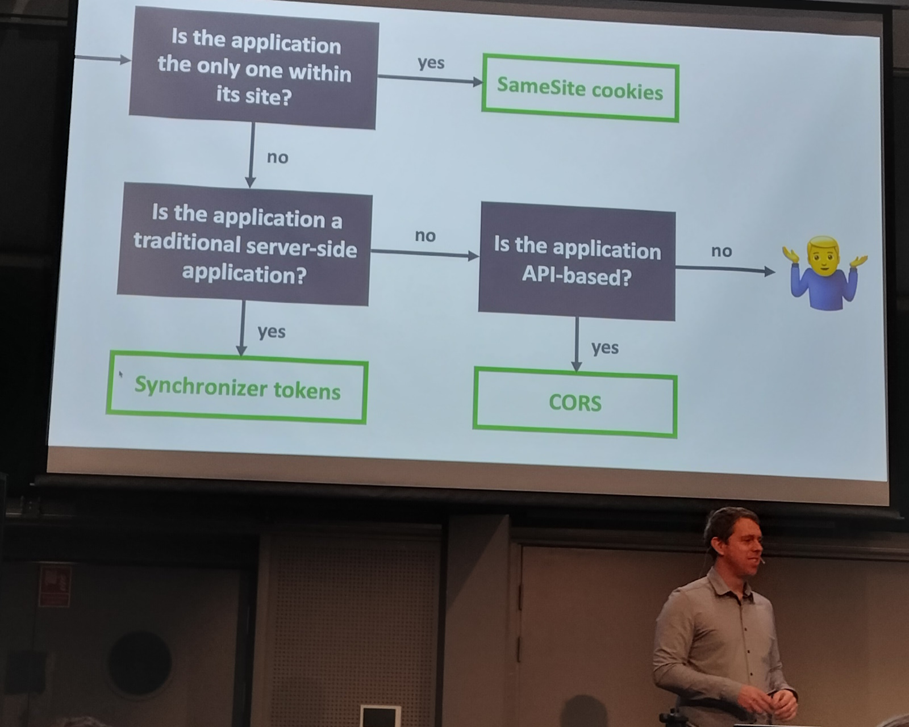
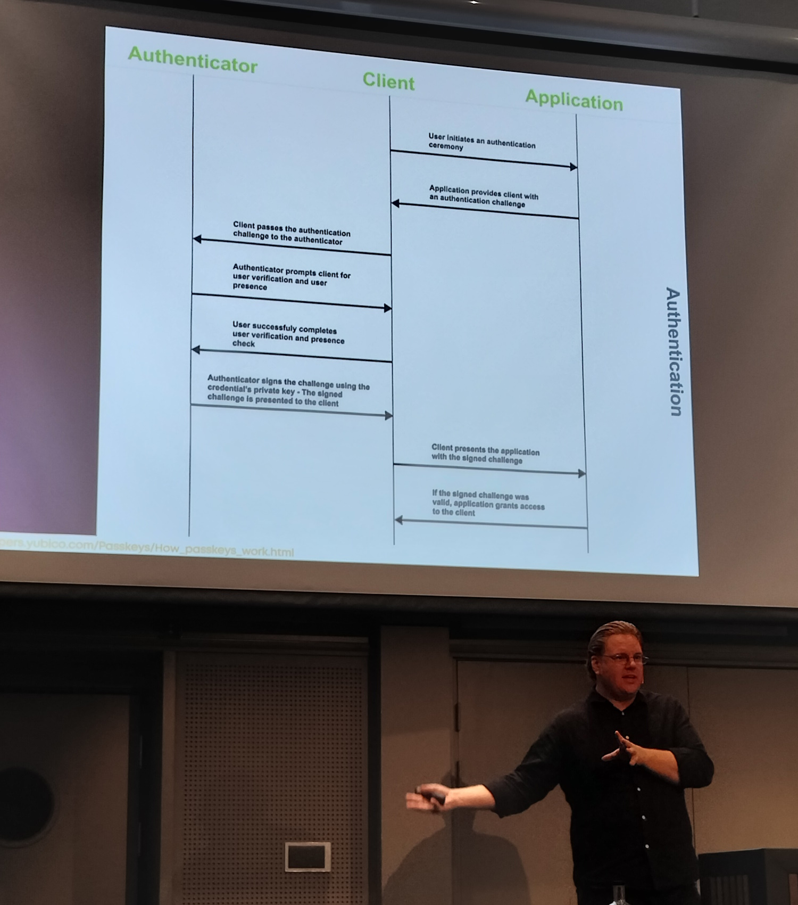

# [NDC Security 2024](https://ndc-security.com/)

NDC Security is a 4-day conference in Oslo in January with 2 days of workshops and 2 days of talks.

Here are my main takeaways from the workshop (Identity and Access Control):
- identity should be immutable, unique, and never re-used (eg don't use email address)
- .NET 1.0 was originally based on username and roles, but since 4.5 it's based on claims
- always validate `ReturnUrl` before redirecting in order to prevent open redirection
- there are a defined list of validation steps that clients should perform on identity tokens
- Data Protection API in ASP.NET Core manages the cookie keys and encryption
- it's important to implement Single Sign **Out** properly to prevent unexpected behaviour
- IdentityServer (or any other security token service) contains all the code to manage auth -
  so that it doesn't need to be duplicated in every client, and the client code is simple
- implicit flow doesn't allow refresh tokens - refreshes with a hidden iframe instead
- code flow has some issues that are mitigated with PKCE (which acts like a nonce to prevent XSS)
- code flow with PKCE is the only flow that will be supported in OAuth2.1
- to avoid issues with cross-site cookies and iframe, use BFF (backend for frontend)

Here are my main takeaways from the talks:
- ransomware is becoming more prolific and effective
- cookie handling in the browsers are becoming stricter in order to block ad tracking,
  which also makes them harder and less predictable to use for cross-site auth (SSO) -
  BFF is a good solution to that problem
- serialization attacks are possible in most json serializers if the attacker can control the data -
  most NoSQL engines are vulnerable (including Redis)
- use security chaos engineering to simulate security attacks and test and practise incident response
- all data should be classified, so that if it's breached we know how bad it is
- asymmetric encryption relies on solving difficult problems, but problems that are hard now may not be in the future
- forward secrecy in TLS 1.3 ensures that even if the private key is compromised,
  past traffic can't be decrypted
- average code base is 80% third party libraries, and 80% of those are never updated
- third party libraries have the same access rights as the app they're in
- "site" is defined as TLD + 1, "origin" is defined as TLD + 2.
  The definition of TLD and the behaviour of browsers with respect to cross-site and cross-origin cookies is constantly changing.
  Again, BFF is the solution
- zero trust doesn't work with humans -
  security culture should teach "trust but verify" instead
- passkeys are a user-friendly, non-technical solution to the problems of passwords
  (unfortunately Kantar prevents them from working on their managed devices, eg my laptop)

Every single session I went to was interesting and informative.
The list above is one bullet point per session.
For all of my notes and links, expand the collapsible section below,
but be warned, they're not in a very comprehensible form.

Expand for my notes

 

## Workshop: [Identity & Access Control for modern Applications and APIs using ASP.NET Core 8](https://ndc-security.com/workshops/identity-and-access-control-for-modern-applications-anders-abel/3cbf535885dc) *Anders Abel*

### Day 1

Apparently the workshop has been going for 10 years, but it's constantly updated and still very much relevant.  
Standard training is a 3-day course,
but this is condensed into a 2-day workshop.
He goes a bit quick sometimes.

Browser talks to webapp, services. Services talk to each other.
Assume zero trust, unlike 10 years ago when we trusted everything inside the firewall.

[`IIdentity`](https://learn.microsoft.com/en-us/dotnet/api/system.security.principal.iidentity?view=netframework-1.1)
and
[`IPrincipal`](https://learn.microsoft.com/en-us/dotnet/api/system.security.principal.iprincipal?view=netframework-1.1)
have been around since the start of .Net and are still the basis of authentication and authorization,
but they're based on a name and roles, which is not very flexible.

Identity name should be:
- immutable (persistent)
- unique
- never re-used

So don't use things like email address, or a social security number that's based on gender (like Norway does/did).
Use a guid.

.Net 4.5 introduced **claims** into .Net framework in 2012.
Claims are a key/value pair, with an optional issuer.

[`ClaimsIdentity`](https://learn.microsoft.com/en-us/dotnet/api/system.security.claims.claimsidentity?view=netframework-4.5)
implements `IIdentity`.
[`ClaimsPrincipal`](https://learn.microsoft.com/en-us/dotnet/api/system.security.claims.claimsprincipal?view=netframework-4.5)
implements `IPrincipal` and contains a collection of `ClaimsIdentity`s.

Claim **key**:
- OpenId defines a set of standard claims
- but it can be anything
- `sub` is kinda like `Name` in original `IIdentity`
  - "human"
  - unique at issuer

Claim **type** - eg to tie name to a well-known name.
Or can specify the type in the constructor.

`IIdentity.IsAuthenticated` is read-only. It's set by defining `authenticationType` in the constructor.

**Tip:** always use the
[4 parameter constructor](https://learn.microsoft.com/en-us/dotnet/api/system.security.claims.claimsidentity.-ctor?view=netframework-4.5#system-security-claims-claimsidentity-ctor(system-collections-generic-ienumerable((system-security-claims-claim))-system-string-system-string-system-string))
(second parameter is `authenticationType`).

ASP.NET middleware can handle request, or just part of it (ie process and continue).
Defined in order, eg first static files, then HSTS, then authentication, then authorization.

[Auth middleware extension methods](https://learn.microsoft.com/en-us/dotnet/api/microsoft.aspnetcore.builder.authappbuilderextensions.useauthentication?view=aspnetcore-8.0)
are badly named:
- [`SignInAsync`](https://learn.microsoft.com/en-us/dotnet/api/microsoft.aspnetcore.authentication.authenticationhttpcontextextensions.signinasync?view=aspnetcore-8.0) -
   creates a session - provider creates a principal which is the parameter to this method
- [`ChallengeAsync`](https://learn.microsoft.com/en-us/dotnet/api/microsoft.aspnetcore.authentication.authenticationhttpcontextextensions.challengeasync?view=aspnetcore-8.0) - initiates sign in
- [`AuthenticateAsync`](https://learn.microsoft.com/en-us/dotnet/api/microsoft.aspnetcore.authentication.authenticationhttpcontextextensions.authenticateasync?view=aspnetcore-8.0) - queries if authenticated

Always validate `ReturnUrl` when redirecting.
[`LocalRedirect`](https://learn.microsoft.com/en-us/dotnet/api/microsoft.aspnetcore.mvc.controllerbase.localredirect?view=aspnetcore-8.0)
does that, or manually check with
[`IsLocalUrl`](https://learn.microsoft.com/en-us/dotnet/api/microsoft.aspnetcore.mvc.iurlhelper.islocalurl?view=aspnetcore-8.0)
and handle if it's not.

[Data protection (DPAPI) in ASP.NET Core](https://learn.microsoft.com/en-us/aspnet/core/security/data-protection/configuration/overview?view=aspnetcore-8.0):
- manages the cookie encryption
- manages the keys
  - rotation
  - sharing across services that need to share, eg multiple webapp instances

In our IdentityServer we skipped key management
["for now"](https://github.com/NIPOSoftwareBV/nfield-identity/blob/master/Nfield.Identity/Startup.cs#L112).
There are
[examples](https://github.com/IdentityServer/IdentityServer4/tree/main/samples/KeyManagement)
in IdentityServer4 source.

`[Authorize("policy")]` attribute (new way).
Or can check in code.
Or in a view.  
`[Authorize(Roles="roles")]` attribute (old way).

`AddPolicy("policy", options => {...})]`
- can just require claims
- or can be more dynamic - `RequireAssertions` - but then can only check in code, not attribute
- if `RequireAssertion` gets too complex, use the authorization handler framework - see the lab

`RemoteAuthenticationHandler` for delegated auth.
`SignInAsync` not implemented - use `ChallengeAsync` instead.  
eg Google doesn't implement `SignOutAsync` because they don't want you to sign out.

Redirect from Google assumes `ReturnUrl` is safe - se we should validate it to prevent open redirection.

Google handler writes directly to the cookie handler that we define first in the pipeline.
- we might not want that
- can add another "temp" scheme in between
- convert Google identity to our identity
- see the lab

Scheme - eg Google, OpenId Connect, cookie, etc - is a configuration plus a handler.

**OpenId Connect** (oidc) "using IdentityServer as an example".

Terms:
- STS [Security Token Service](https://en.wikipedia.org/wiki/Security_token_service)
- [Identity Provider](https://en.wikipedia.org/wiki/Identity_provider) (IDP)
- Identity Server
- I think these are all basically the same thing BICBW

Endpoints:
- discovery - `/.well-known/openid-configuration` - static json
- authorize - html
- token - api

nonce (number used once) is OpenId Connect's way of doing XSS protection,
ie checking that the response is for my request.

Identity token contains header, payload, signature.

Discovery endpoint includes `jwks_uri` - list of keys so that we can validate the signature.

There's a list of validations that we should do on the token - defined in
[OpenId spec](https://openid.net/specs/openid-connect-core-1_0.html#IDTokenValidation).  
Use
[`JsonWebTokenHandler.ValidateTokenAsync`](https://learn.microsoft.com/en-us/dotnet/api/microsoft.identitymodel.jsonwebtokens.jsonwebtokenhandler.validatetokenasync?view=msal-web-dotnet-latest#microsoft-identitymodel-jsonwebtokens-jsonwebtokenhandler-validatetokenasync(system-string-microsoft-identitymodel-tokens-tokenvalidationparameters))
to do it - using properties from the key.  
But then also validate nonce:
- that's OpenId-specific - not part of JWT
- nonce is usually generated in the authorize request and written to a cookie,
  and then read back from the cookie when validating

AAD can also be used as identity provider, but it's not very customizable.
IdentityServer lets you fully customize.

IdentityServer is just a place to put all the code we've been writing up to now
so that it can be shared across multiple clients.
The client code to use it is very simple - just configuration in `Startup`.  
One IdentityServer that multiple clients use - SSO.

**Tip:** always use https, even locally, because it's handled differently to http.

### Day 2

Use multiple cookie schemes for intermediate sign in steps.
Each scheme must be complete when signed in to it.  
A reason why you're often asked to enter a code that's sent in an email,
rather than clicking a link in the email,
may be to make sure user stays in the same browser (session).

oidc builds on oauth2.

`response_type=token`: implicit flow.

`scope`: requested claims - no guarantee that they'll be returned.
But the provider should at least know about them.

`[Authorize]` triggers challenge.

**SingleSignOut**
- cleanup local session
- cleanup at STS
  - notify other clients in same session
  - hidden iframe on STS client signed out page - one iframe for each client
  - in Duende IdentityServer the list of clients is in `Config.Clients`

NB: don't sign out on get (`OnGet`) request - unless we add XSS protection manually.

`LoggedOut` page
- can skip the `Logout` prompt
- send token as XSS protection

`Logout` page could maybe be an iframe on client - Anders couldn't think of any reason why not.

**Federation Gateway**  
Multiple clients talk to FG.
FG manages auth with multiple identity providers - AAD, Google, etc.

Can have many providers and user has to choose.
In order to reduce the list,
do a customer-specific start page and filter based on where you came from.
Or first ask for email,
and then only show list of relevant providers on next screen.  
This is called **home realm discovery**.  
Client sets `acr_values` in request - how it does that is up to client.

Server app (cf browser app with user) sends `client_secret` (among other things) in request to STS.
Gets an access token back.  
Access token is used to call API.  
Access token is usually transmitted in `Authorization` header as `Bearer` token.  
No signin/signout/challenge because we just use the token.  
Client shouldn't need to inspect the token.
Properties from the token that are needed for validation
are also returned in the response along with the token - scope, expiry.  
API should validate token, eg scope, client id.

Scope is a set of information about resource.

Only introduce scopes when you need them - start with just one (for each app).

User-centric - token on behalf of user.
Delegation/impersonation.
Mainly skipped this part of the course,
but mentioned a bit in the discussion - doesn't seem particularly difficult.

Access token cf id token:
- access token lifetime is finite - eg 15 minutes
- request a refresh token - scope `offline_access`
- refresh token used to request new access token
- refresh tokens can also be stolen, but they can be revoked,
  unlike access tokens that are valid until they expire
- refresh tokens typically have a very long expiry, eg years

Code flow
- `token_type=code`
- has issue - authorization code inspection
- mitigated with [PKCE](https://pragmaticwebsecurity.com/articles/oauthoidc/from-implicit-to-pkce.html)
  - something like a nonce
  - `code_challenge=hash(code_verifier)`
  - `code_verifier` is used when exchanging code for access token
  - ASP.NET Core does this by default
  - full name: "code flow with PKCE"

OAuth2.1 - the next version - will only have code flow with PKCE - the others are deprecated.

Implicit flow doesn't allow refresh tokens -
use hidden iframe to refresh access token instead

BFF - backend for frontend - client only talks to one backend

Native apps can open broswer for SSO so that user can trust it.
Return URI is an app-specific URI that goes back to app.

## Day 3

### [Keynote: How I Met Your Data](https://ndc-security.com/agenda/opening-keynote-0soy/0k71y3zuhz9) *Troy Hunt*

I arrived early to secure a good seat
([Boom! Boom!](https://en.wikipedia.org/wiki/Basil_Brush))

There were surprisingly few people - I guessed 200 -
although Troy said this was the biggest NDC Security ever with 350 attendees.

The keynote was some stories from 10 years of running
[HaveIBeenPwned](https://haveibeenpwned.com/).

Encrypted data is safe unless the key is compromised.

[politie.nl](https://politie.nl/checkyourhack)
have a service similar to
[HaveIBeenPwned](https://haveibeenpwned.com/),
but for a very limited dataset.

OTP in
[1Password](https://1password.com/)
is okay for the less critical sites.

### [52 minutes from initial access to ransomware - is your defensive team ready?](https://ndc-security.com/agenda/52-mins-from-initial-access-to-ransomware-is-your-defensive-team-ready/0xynjm4t1kv) *Maarten Goet*

He's from the Netherlands - MVP and Regional Director.

HumOR - human operated ransomware:
- 2023 - up 250% (since 2022?)
- 70% are organizations with < 500 employees
- 80% are from unmanaged devices

Threat actors:
- individual teenagers
- financially motivated - ransomware as a service
- nation states

2010:
- target individuals
- opportunistic

now:
- target entire organizations
- more targetted
- double extortion
  - data exfiltration
  - encryption

In The Netherlands, 41% pay the ransom.

[ft.com](https://ig.ft.com/ransomware-game/)
has a ransomware negotiation simulator.

Ransomware as a service:
- 2500 - initial access
- 60 - ? (check slide deck)
- 20 - ?
- 1 - ransomware event

Mitre Att&ack - see slides - stages.

47 minutes average from initial access to full encryption.

Identity attack.

Microsoft Defender for Cloud
- can see attack vector, eg a server with RDP open can access something
- and XDR
- extend with Azure Sentinel

Microsoft
- "Defend at Machine Speed"
- because human can't beat 47 minutes
- EDR - automatic attack disruption

Microsoft Defender Deception
- honeypot
- released soon

I asked him about the risk of local admin -
he said that wasn't really a problem -
need to look at the big picture and make sure it can't do damage on the network.

### [The Future of Cookies](https://ndc-security.com/agenda/the-future-of-cookies-041k/858a3e38caa2) *Anders Abel*

`SameSite=Strict` - don't send in iframe  
`SameSite=Lax` - `GET` only - not `POST` or iframe  
`HttpOnly` - not accessible to javascript

Same site - domain - subdomain can be different.
Subdomain defined by
[public suffix list](https://publicsuffix.org/).

There's no way to query properties of cookie:
- eg evil subdomain could set a cookie for a domain
- other domain doesn't know that evil set it
- mitigate by using domain in cookie name

oidc spec says to use iframe (to refresh token?)
- so when browers prevent ad tracking, they also broke oidc iframe
- use back-channel logout instead
- Safari uses AI to block - so unreliable/unrepeatable
- logout of IdentityServer will fail - should check success
- Firefox has a better solution

Chrome makes money from ads, so has mixed interests.
More flexible - can enable/disable.

Cross-site cookies are problematic and will become more so.

### [PAR: Securing the OAuth and OpenID Connect Front-Channel](https://ndc-security.com/agenda/par-securing-the-oauth-and-openid-connect-front-channel/6c50dd558eb3) *Dominick Baier*

I changed my mind about going to this talk at the last minute,
mainly because the previous talk said that front channel is dead,
and went to this instead:

### [Implicit and Mutation-Based Serialization Vulnerabilities in .NET](https://ndc-security.com/agenda/second-breakfast-implicit-and-mutation-based-serialization-vulnerabilities-in-net-09xa/06cw2pnysiq) *Jonathan Birch*

Mutation-based.

Don't do `Type.GetType(string)`.

Polymorphic serializers are bad - self-describing data.

Exploit - hack a type that has side-effects, eg:
- `AssemblyInstaller`
- `ObjectDataProvider`

Deserialize json with a type property, eg
`{"$type": "..."}`

Read/write object - db, cache, etc.

`Deserialize<T>()` - `T` sometimes doesn't matter to deserializer - it's just a cast afterwards.  
But even when it does matter, can also have an inner type.

Mutation:
- write a `Dictionary`
- when deserialized uses type property

Exploited when deserialized - what happens next is irrelevant.

Attacker needs to be able to control, eg one key of dictionary.

Serialization binder
- control allowed types
- but can be bypassed, especially with generics, and nested types
- don't use them - it's too hard to do it right.

BinaryFormatter won't serialize boxed value types assigned to an interface.
The only interfaces that allow this are:
- `IConvertible`
- `IComparable`
- `IFormattable`

These are not common types, but can work around with generics again.

These vulnerablities are not fixed - for various reasons.

`System.Text.Json.JsonSerializer` is the only good one.

Most NoSQL engines are vulnerable.

He mostly talked about .Net FF - he had a hard time finding some for .Net Core.

### [Optimizing Cloud Detection & Response With Security Chaos Engineering](https://ndc-security.com/agenda/optimizing-cloud-detection-and-response-with-security-chaos-engineering-0cjg/0s36tfo28ih) *Kennedy Torkura*

Talk was largely based on the
[Security Chaos Engineering (SCE) mind map](https://www.mitigant.io/blog/security-chaos-engineering-101-the-mind-map-feedback-loop).

Chaos Monkey was introduced by Netflix.

Security Chaos Engineering:
- cyber security
- cyber resilience

Why:
- detect blindspots
- overcome security theatre

Practise ransomware scenario.

It will test the monitoring - SIEM etc - so if we don't have them it's a bit pointless.

Example - AKS security compromised - leads to AWS S3 bucket ransomware.

EDR -> NDR -> XDR -> CDR

**[Mitre Att&ck matrix](https://attack.mitre.org/)**.

[Mitigant tool](https://www.mitigant.io/) can, eg emulate AndroxGhost malware attack.
DataDog only gives a low severity alert.

They have a set of attacks that I can try.
Check what they have for Azure.

Starts with a compromised account
- you might say that makes the test a bit meaningless
- but that is real scenario
  - see previous talk
  - 80% of attacks start with compromised identity

They have a tab "evidence" - will be less if we have less monitoring.

This assumes hackers are in, and then what will happen next?

Could run continuously, but most don't because the human element is also important.

Add chaos testing to my list of concerns.

### [Purple is the New Black: Modern Approaches to Application Security](https://ndc-security.com/agenda/purple-is-the-new-black-modern-approaches-to-application-security/73db1a6df599) *Tanya Janca*

Purple team - helping red team and blue team collaborate.

Red team - hackers - very popular (eg lots of movies).  
Blue team - less sexy - eg incident response.

Zero trust is the opposite of human nature.  
Assume breach.

**Classify all the data** - so if it's breached we know how bad it is.

Talk was aimed at security professionals - not developers.

She mentioned "security as code" and I asked her what she meant by that.
I think she explained that it meant,
eg the pipeline can add security headers when it sees it's missing,
but later I think I misunderstood and that's not what she meant.

### [Asymmetric Encryption: A Deep Dive](https://ndc-security.com/agenda/asymmetric-encryption-a-deep-dive/5014163b148e) *Eli Holderness*

[RSA](https://en.wikipedia.org/wiki/RSA_(cryptosystem))
was the first asymetrics scheme in 1977.

She explained it in a clear way, but I lost it after that.
But it was still an entertaining talk.

Elliptic curves replaced RSA for a couple of decades.

Shor's algorithm solve the difficult problems that they rely on.

Quantum computers - harder problems.

Encrypt now for schemes that quantum computers can solve in the future -
traffic could be stored and decrypted later -
[Dilithium/Kyber](https://blog.chromium.org/2023/08/protecting-chrome-traffic-with-hybrid.html).

## Day 4

### [Unlocking The Secrets Of TLS](https://ndc-security.com/agenda/unlocking-the-secrets-of-tls/0r79nspzqh7) *Scott Helme*

RSA is asymetric - only used for exchanging symetric key - because it's expensive.

1994
- https invented
- server sends public key
- client encrypts with it
- negotiate/exchange key

Snowden - 2013:
- NSA encrypts all traffic and stores it - PRISM
- they forced his email provider to reveal his private key
- and then they can decrypt all the traffic he sent in the past

Heartbleed - 2014:
- leaked private key from server

This is a flaw in RSA key exchange.  
[Diffie-Hellman key exchange](https://en.wikipedia.org/wiki/Diffie%E2%80%93Hellman_key_exchange)
was invented in 1977, but not used until after heartbleed.  
DHKX, or DHEKX - E=ephemeral - new key for each session.
So in case one session is cracked, impact is limited.

Forward Secrecy - 2008:
- problem/solution was theoretical, but no-one saw a reason to use it until Snowde
- mandatory in TLS 1.3
- reduces risk (impact?) of losing private key
- private key only used for establishing forwarding secrecy - not whole exchange
- ensure that even if private key is compromised, past traffic can't be decrypted

### [Reviewing NuGet Packages security easily using OpenSSF Scorecard](https://ndc-security.com/agenda/assessing-nuget-packages-more-easily-with-security-scorecards-0x8x/01l9zdcmcx1) *Niels Tanis*

Another [Dutch speaker](https://github.com/nielstanis/NDCSecurity2024).

Average code base is 20% yours, 80% other people's.

Veracode publishes
[State of Software Security](https://www.veracode.com/state-of-software-security-report)
report annually.

79% of third party packages are never updated.

All packages have same access rights as the app they're in.

`dotnet listpackage --vulnerable`: direct dependencies.  
`dotnet listpackage --vulnerable --include-transitive`: also transient dependencies.  
dotnet 8 restore does this by default.

OpenSSF scorecard - give open source projects a score based on
[various criteria](https://securityscorecards.dev/#the-checks):
- code vulnerabilities
- maintenance
- etc

`RestorePackagesWithLockFile` option in MSBuild will create a `package.lock.json` file.

Build provenance - info about environment used for the build - packaged in the package.

[deps.dev](https://deps.dev/) is a similar service - from Google
- includes OpenSSF scorecard
- has an API

OpenSSF is part of Linux Foundation.

[SharpFuzz](https://github.com/Metalnem/sharpfuzz) - fuzz input.

[Microsoft Application Inspector](https://www.microsoft.com/en-us/security/blog/2020/01/16/introducing-microsoft-application-inspector/)
- analyzes to see what kind of application it is
- eg, has crytography, API, cloud, has auth, etc

**Tip:** use OpenSSF to get score of our repos,
and see the worst dependencies and see if we can remove/update them.

### [The Past, Present, and Future of Cross-Site/Cross-Origin Request Forgery](https://ndc-security.com/agenda/the-past-present-and-future-of-cross-sitecross-origin-request-forgery-0yyc/0o14vrn2ffp) *Philippe De Ryck*

CSRF has always been a problem - recognised around the year 2000.

Simple mitigation - send secret in cookie that's also validated:
- synchronizer tokens
- needs to be done explicitly by dev - easy to forget

SameSite cookies:
- site = TLD + 1
- Chrome made same site the default behaviour - unless you specify `none`
- `lax` is a good choice for most apps
- set it explicitly - so other browsers will do the same as Chrome

[BFF](https://learn.microsoft.com/en-us/azure/architecture/patterns/backends-for-frontends)
uses cookies to talk to API.

It's possible to post form data that looks like json:
- for iframe/js attack
- name is first part of json
- value is second part

Cross-origin but same site - TLD + 2

Cross-**origin** request forgery:
- why would you give attacker control over subdomains?
- dangling CNAMEs
- a multi-tenant app might have a subdomain per tenant

CORS => preflight (`OPTIONS` request).

js `no-cors` mode = "2008 mode".

API should require custom header:
- `no-cors` client can't send it
- and enforce (validate) content-type

[Duence BFF library](https://duendesoftware.com/products/bff) does all this.

### [Social engineering pentesting. - How it is done, and what you should think about](https://ndc-security.com/agenda/social-engineering-pentesting-how-it-is-done-and-what-you-should-think-about-0juu/0snwepno5wg) *Ragnhild "Bridget" Sageng*

Technique used to get a person to perform action or disclose information.

Phishing test - very simple example.

There's an ethical responsibility.

OSINT:
- information on web - about people or companies
- social media
- DNS, certs, etc
- Google Maps (history)

Phishing - email.  
Vishing - voice phishing - eg phone call.  
Smishing - SMS phishing.  
Quishing - QR code phishing.

Zero Trust doesn't work with humans.
Trust but Verify instead.

Security culture.
Awareness.

A test done poorly can have negative consequences.
Even phishing tests can cause hostility

Report:
- try to stay anonymous
- consequences

The failure of an individual is not the individual's fault - it's a system failure.

Debrief is important:
- see how it affected victims
- explain that it's not their fault

Culture:
- what's learned is easily forgotten
- should be continuous training

Practise - eg:
- say that Fred will be coming for a test sometime in the next 3 months
- have someone come with a T-shirt with "Fred" in big letters on the front
- gives people confidence to confront suspicious strangers

### [No Size Fits All: Empowering Engineers with Custom Application Security tests](https://ndc-security.com/agenda/no-size-fits-all-empowering-engineers-with-custom-application-security-tests-0mgr/09szzp7feis) *Michal Kamensky*

Generic SAST/DAST tools can find generic vulnerabilities. There are lots of such tools.

App specific mitigations are not recognised by generic tools,
and so we'll get used to ignoring the warnings.

Security decorators
- input validation
- challenge - check decorator is applied everywhere it should be
- solution - SAST rules
- the demo used [SemGrep](https://semgrep.dev/products/semgrep-code/) SAST

Rules - check we're not calling vulnerable methods in libraries.

DAST
- demo used [Nuclei](https://github.com/projectdiscovery/nuclei)
- also has rules
- will do fuzzing

Can run SemGrep in the pipeline - not free.

### [Passwords are Dead, Long live Passkeys!](https://ndc-security.com/agenda/passwords-are-dead-long-live-passkeys-09cu/09kh8w0kjwe) *Stephen Rees-Carter*

Problems with passwords:
- humans are the weakness
- gullible - will tell attacker if he asks the right way

MFA is technical solution.

Passkeys use existing technologies in a user-friendly, non-technical solution.

[passkeys.io](https://passkeys.io/) has a demo.

Passkey is linked to device
- Windows Hello is disabled by Kantar :(

Use passkey on phone:
- create new
- can have as many passkeys as you like
- connect with Bluetooth

Passkey is resistent to phishing - there's nothing to steal (on client).

Passkeys is still optional (like biometrics)
- because it's not supported everywhere
- so there's still a username/password fallback

[passkeys.directory](https://passkeys.directory/) - list of sites that support passkeys.

[passkeys.dev](https://passkeys.dev/) - how to implement front end code.

[webauthn.me](https://webauthn.me/)
- demo
- webauthn is the protocol
- passkeys is a layer on top
  - user-friendly
  - sync
  - etc

Public key on client (sign in flow)
- app sends challenge
- signature flow
- validate signature in app

