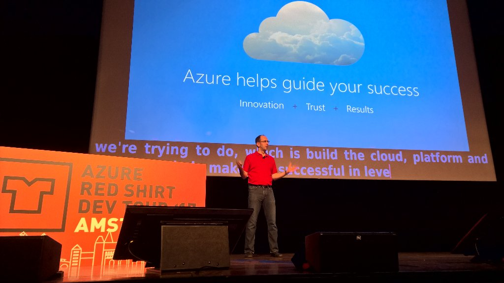
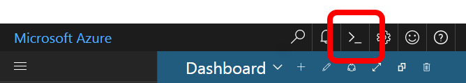
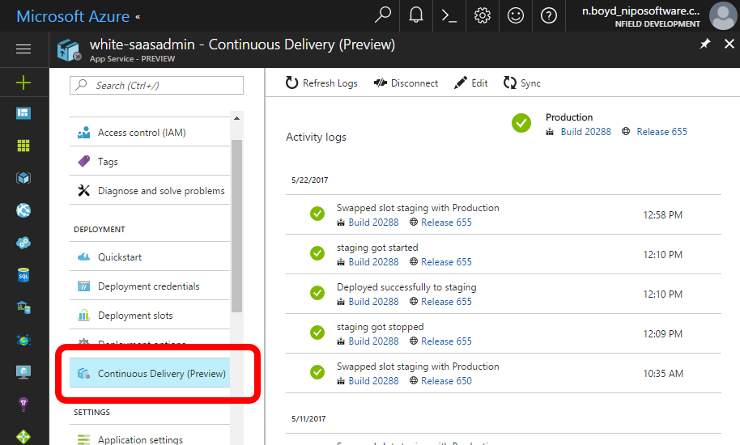

# Azure Red Shirt Dev Tour Amsterdam 24 May 2017

[](https://twitter.com/carophillips1/status/867287380688064513)

1100 Azure developers turned up for a free talk by Scott Guthrie.
He demonstrated a few new features of Azure that people might not be aware of,
some of which may be still in preview.

## M-series VM

The
[M-series](https://docs.microsoft.com/en-us/azure/virtual-machines/virtual-machines-windows-sizes)
VM is based on 
[Windows Server 2016](https://www.microsoft.com/en-us/cloud-platform/windows-server)
which allows virtualization inside a VM.
It can have up to 120 cores and 3.5TB of RAM.
He demonstrated a VM inside a VM inside a VM...

I was thinking that this might be useful for running our own Docker containers since the
[Azure Container Service](https://azure.microsoft.com/en-us/services/container-service/)
doesn't support Windows containers.

## Cloud shell in portal

Maybe you didn't notice the shell icon in the portal.



This starts a VM with a bash command where you can run Azure CLI commands.
It even lets you run Vim.

## Application Insights exception debugging

You can click down on an exception in App Insights and there's a link that lets you open a debug session in Visual Studio.

## Deploy from git

When you configure an App Service to deploy from git
(which is already quite cool - `git push azure`)
then you can see the history in the portal and choose to redeploy any previous version.

## Staging slots

- it's possible to lock down the staging URL so that only authorized people can access it
- can use any URL for the staging slot, eg a GUID
- can use a custom domain for the staging slot
- can ramp up the swap, rather than swapping all at once. This can also be useful for A/B testing

## CI/CD

There's a tab in App Services for Continuous Delivery.
If CD is not configured then this can start a wizard to set up a release pipeline.
If it is configured then it shows the history of deployments.



## Xamarin Live Player

You can develop Xamarin iOS apps in Visual Studio on Windows.
If you attach an iOS device, eg an iPhone,
then you can see a live preview while you're designing views,
and quickly deploy to the device.

## [CI/CD for Xamarin](https://mobile.azure.com/login)

You can configure a CI/CD pipeline for iOS devices that will build, deploy and test on multiple Mac/iOS devices in the cloud.

## Security Center / Advisor

The portal can proactively alert you about many misconfigurations,
including security, availability, performance, cost.
If configured, it can tell you about possible SQL injection vulnerabilities.

## Cosmos DB

[Cosmos DB](https://azure.microsoft.com/en-us/services/cosmos-db/),
formerly DocumentDb, is Microsoft's globally distributed, multi-API, NoSQL database.

It has multiples SLA's - not just for availability, but also for performance, throughput, etc.

It has multiple API's, which means you can address it as MongoDb, Table Storage, Gremlin (graph), and others.
This means that you can, for example import the Gremlin module into Node to access it that way.
The management interface is optimized for the chosen API.

You can choose from several consistency models:
- one write node, eventual consistency
- session consistency
- strong consistency

Performance is provisioned at a per second level, but throttling is done on a one minute average.

## Docker

Right-click > add Docker support to projects in Visual Studio.
Good support for debugging across projects in different containers.

Docker CI/CD in preview.

It's possible to deploy Docker containers to Service Fabric (as opposed to Container Service).

## C# 7 multiple return types

He didn't explicitly mention this, but I noticed it in one of the demos.

```cs
(string, string, string) MyCoolFunction() // tuple return type
{
    //...
    return (firstValue, secondValue, thirdValue);
}

var (first, second, third) = MyCoolFunction(); //Implicitly Typed Variables
```

## Azure Functions

You can debug Azure Functions locally in Visual Studio.
In my experience this has been a pain point of Azure Functions,
but he made it look easy.

## Cognitive Services

AI/ML.
There are lots of built-in features that you can use and extend.
He demonstrated the image recognition that he taught to recognize a dog and a cat.
And extending the face recognition to recognize specific people.

There is also sentiment detection, which he demoed to recognize the sentiment of a Twitter feed.
He also mentioned using it to recognize sentiment of a call center
(I guess you first need a speech-to-text library, but that's part of the same concept).

## Managed disks

In retrospect, hard disks as part of a storage account was a bad idea because you can't put them in availability sets.
[Managed disks](https://azure.microsoft.com/en-us/services/managed-disks/)
solves that problem.
It's easy to migrate from the old disks to managed disks,
although it'll require downtime within the VM availability set.

## Just-In-Time Admin (coming soon)

You can disable admin access for a VM.
This will close ports (etc) for improved security (reduce the attack surface).
It can be enabled for a limited time if you need it.

